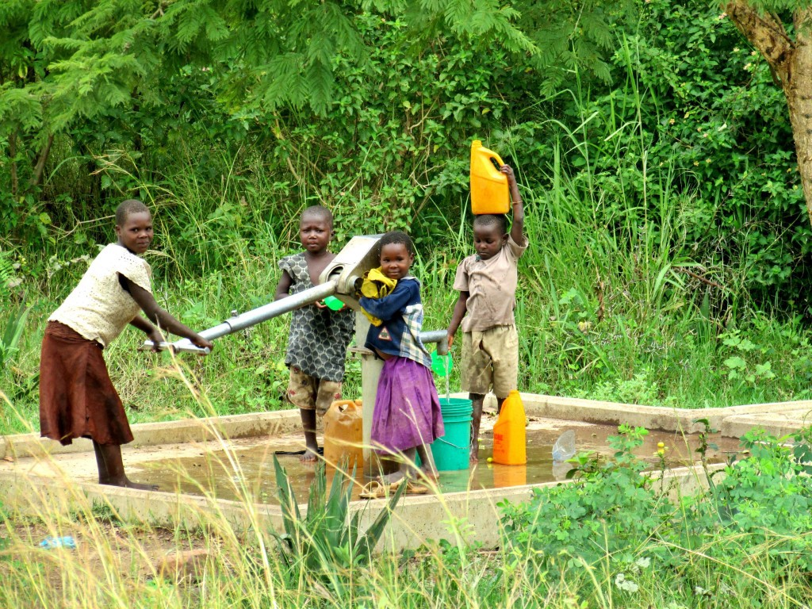
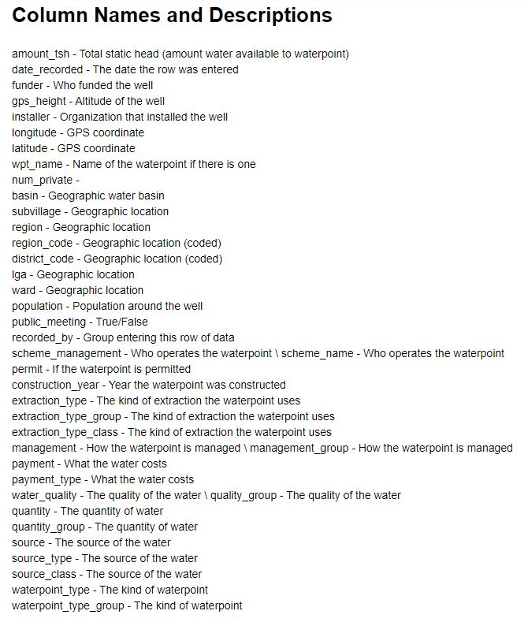
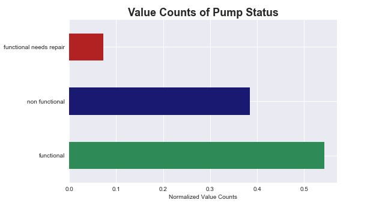
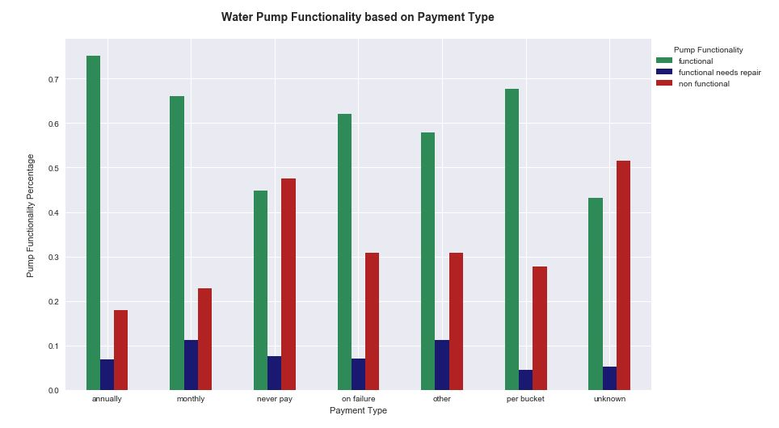
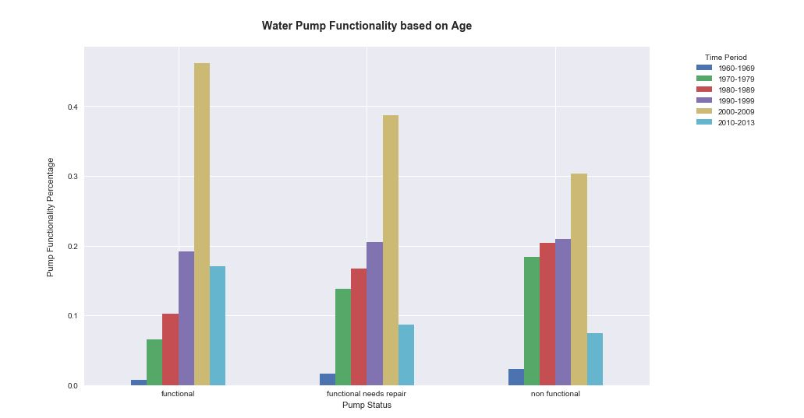
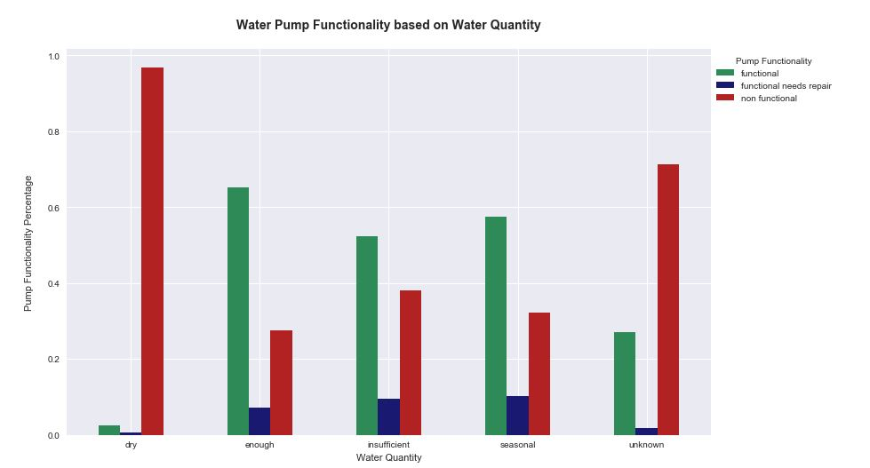
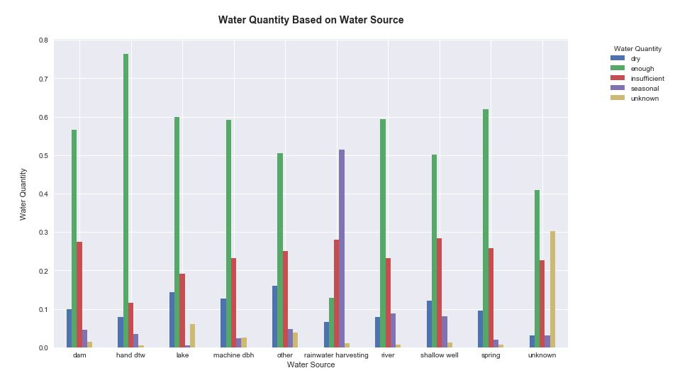
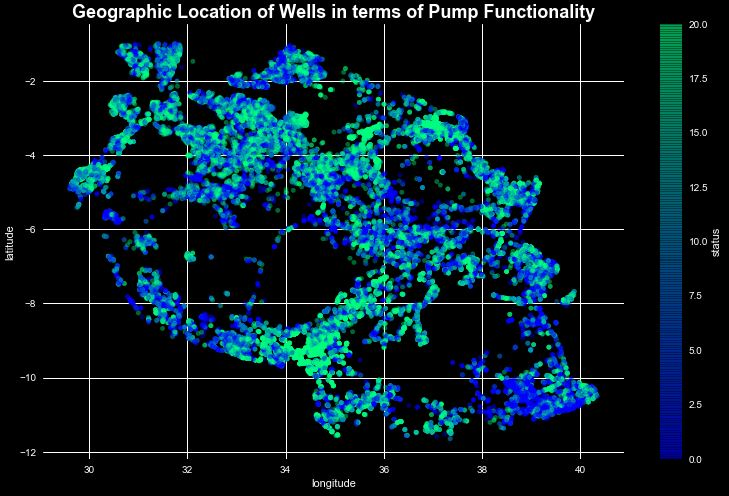
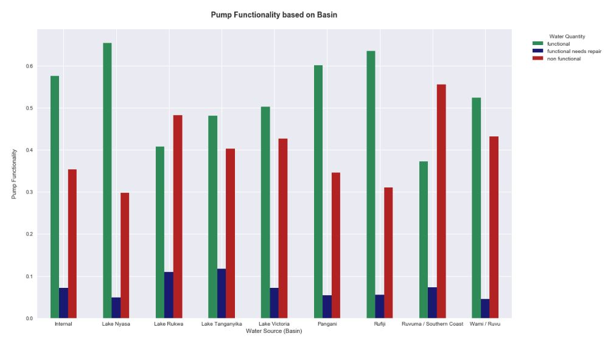
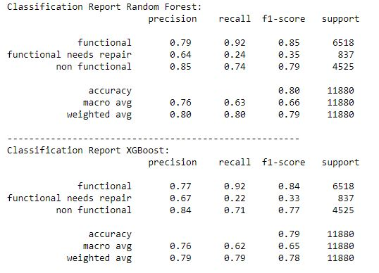

# Pump it Up: Data Mining for Tanzanian Water Crisis
## Predicting Operating Condition of Water Pumps in Tanzania

Local children pump ground water in the Mara River Basin, Tanzania. © Ana Lemos 2016 http://maraselva.fiu.edu/en/fetching-water-on-a-saturday-morning/

## Goals and Overview

Tanzania is a developing country with a large demand for water. Because of this waterpoints have been established all across the country. Many of these pumps are non-functional or need repairing. It is crucial to be able to determine when a pump might need a replacement or repair so that the people who rely on these waterpoints are safe. The goal of this project was to use real data to construct a model using ensemble methods that could, as accurately as possible, predict the functionality status of water pumps in Tanzania based on select features.

# Importing and First Impressions

To start, the data was imported:

The columns and different datasets that were provided were inspected. The trainingsetvalues.csv held the data was going to be used to train the model while the trainingsetlabels.csv provided the functionality status of the training set or in other words, our target for the model.
The testsetvalue.csv dataset contained the data we would then use our model on to make predicitions on the operating condition of those waterpoints.

# Data Cleaning

To explore and manipulate the data appropriately, the data first needed to be cleaned. The data was first checked for duplicates of which, none were found and then NaNs were tackled. 

As shown above, many of features provided exact or very similar information. To account for multicolinearity as well as redundant features, the features were narrowed down and selected for based on which seemed more generalizable or which had less unknown datapoints.

# EDA

Now, with the data cleaned, it was time to get more familiar with the data. In this section, I answered questions that I thought would be interesting to know about the water pumps in Tanzania based on our problem.

First I checked the Value Counts for the Pump Status of the training set:

Functional: 54.3%
Non-Functional: 38.4%
Functional Needs Repair: 7.3%

## Question 1: Do payment plans have any effect on pump functionality?

### Conclusion 1:

From the data, it can be observed that pumps that are never paid for tend to have more non-functional pumps. The unknown category is likely to be more pumps that are never paid, based on the similarity of pump functionality distribution. Finally, it seems that those that pay in planned time increments tend to have less non-functional pumps than those that are paid for by quantity or failure.

## Question 2: How does the age of a well relate to it's functionality?

### Conclusion 2:

There were many pumps with unknown construction periods. For the case of this question alone those were not included. It appears that a greater number of the non-functional pumps tend to be older. And more recently constructed pumps (2000s and on) seem to be more likely to be functional.

## Question 3: How are Water Quantity and Water Pump Functionality related?

### Conclusion 3:

Pumps that are dry tend to be non-functional. Wells with enough water tend to be more functional than their counterparts. The unknown data is likely dry as many of the water pumps are non-functional, which can be seen in the "dry" category.

## Question 4: How are Water Source and Quantity related?

### Conclusion 4:

This graph brings light as to which water sources may need more attention or which sources are the best when deciding to build a pump.

## Question 5: Does Geographic Location matter when it comes to Pump Functionality?

### Conclusion 5:

Although there is decent mix of pump functionality, there appear to be pockets of concentrations of each category in certain areas such as the south west containing many non-functional pumps.

## Question 6: How are basin and pump functionality related?

### Conclusion 6:

This graph visualizes which basins tend to need more focus and which tend to perform better. 

# Building the Model using Random Forest and XGBoost

The models were both tuned for which hyperparameters would allow for the greatest accuracy using GridSearchCV. Below is the classification Report for both models:

These models did not account for class imbalance. Using SMOTE, the data was resampled so that each category of pump functionality were equally represented and the models were trained on this transformed data, improving the results of the models as shown in the classification report below:

# Project Submission and Final Remarks

This project was part of a competition hosted by Taarifa. The goal was to predict as many of the testset water pumps correctly as possible in efforts to improve the Water Crisis in Tanzania. After finishing my models, I used the Random Forest Classifier trained on the SMOTE transformed training data to predict the operating status of the waterpoints on the test set. When completed, the results were submitted to https://www.drivendata.org/competitions/7/pump-it-up-data-mining-the-water-table/. 

The results for the model predictions:

The model was able to predict 78.42% of the data from the test set when submitted on the website. Some things that could be done to improve the model are likely running longer GridSearchCV, which I did not have time to do. There are probably better hyperparameter tunings that would improve the model. The narrowing of features could be explored more to see if improvements could be made by selecting different columns sharing similar information or narrowing down the categories differently.